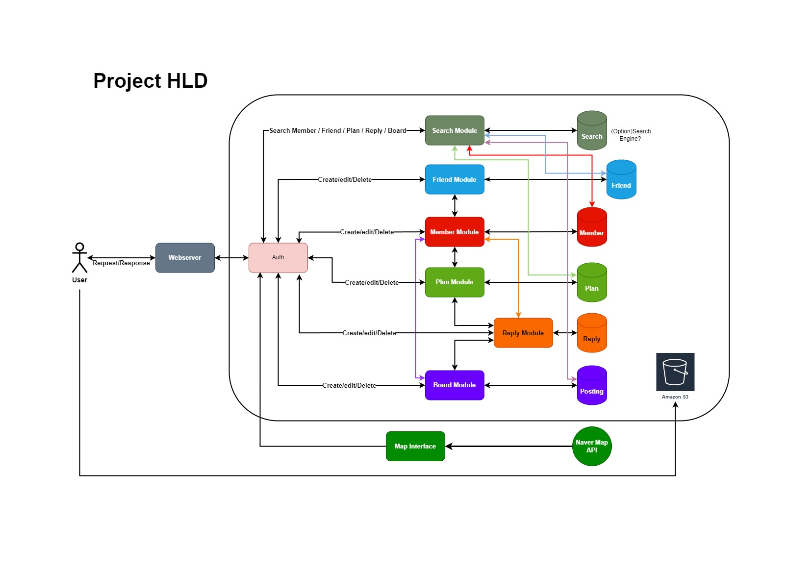
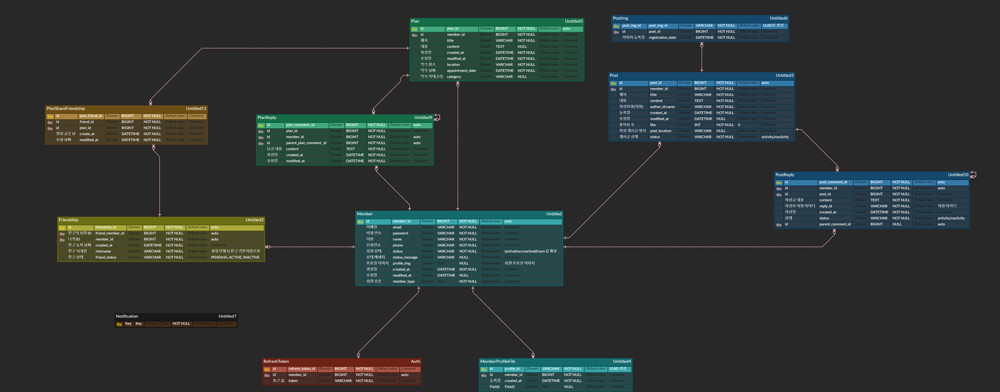
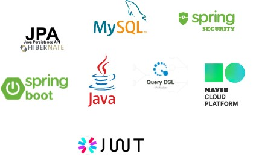
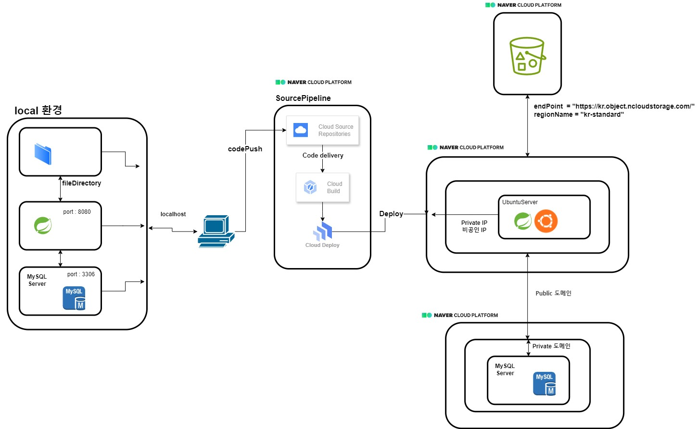

MapWithPlan
===========
실제 서버에 대한 학습과 배포를 목적으로 하고 있습니다.

지도 기반 일정 기록 플랫폼 서버입니다.
지인들과 일정을 공유할 수 있으며,

일정이 있는 해당 지역에 커뮤티니도 운영하는 서버입니다.

 [OverView](https://ovenapp.io/view/igQ9zwNX8hZeELH4pUkpYjcAqXwPrMgd/)

 [ProtoType](https://ovenapp.io/view/kQ9bpGlA8kSjXexXvNPTym1u2JSNatnK/)

### 1. 프로젝트 구조
- HLD (High-level design)
  

- ERD
  

### 2. 프로젝트 주요 관심사
- 공통 관심사
  - 지속적인 성능 개선
  - 코드 리팩토링
  - JavaDoc 을 사용한 코드 설명

### 3. 브랜치 관리 전략

Git flow 전략에 따라 main branch 와 develop 브랜치를 두고,
개발된 feature 들을 develop 브랜치에 merge 합니다.
그후 develop 브랜치를 main branch 에 merge 합니다. 

[참고 자료]

[우아한 형제들 기술 블로그](https://techblog.woowahan.com/2553/)

### 4. 테스트

##### 4.1 테스트 코드 작성

- Mockito, Framework, DB 에 의존하지 않는 테스트 코드 작성(Fake 객체를 만들어 활용, 빠른 테스트 검증 가능) 
- 소형(단위) 테스트 코드 작성

### 5. 사용 기술 및 환경

### 6. Wiki
[Project Wiki](https://github.com/f-lab-edu/map-plan/wiki)

### 7. CI & CD

